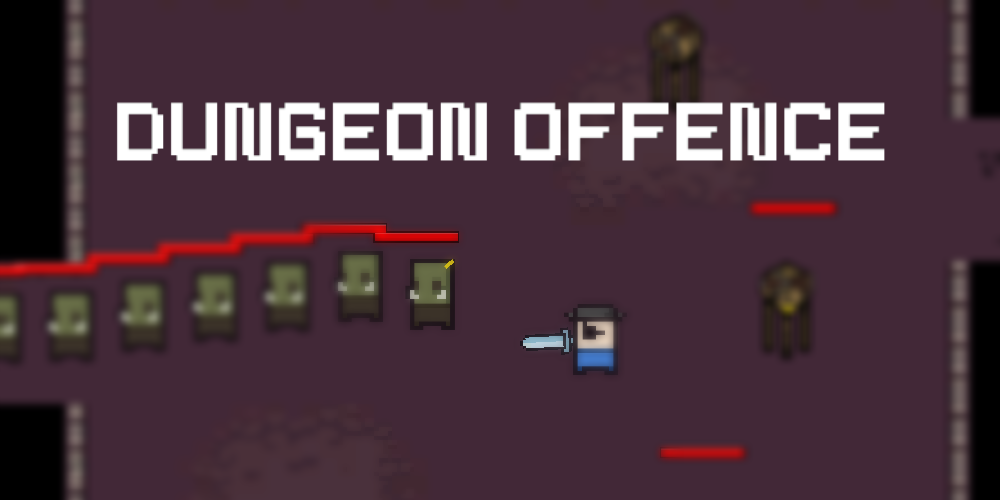
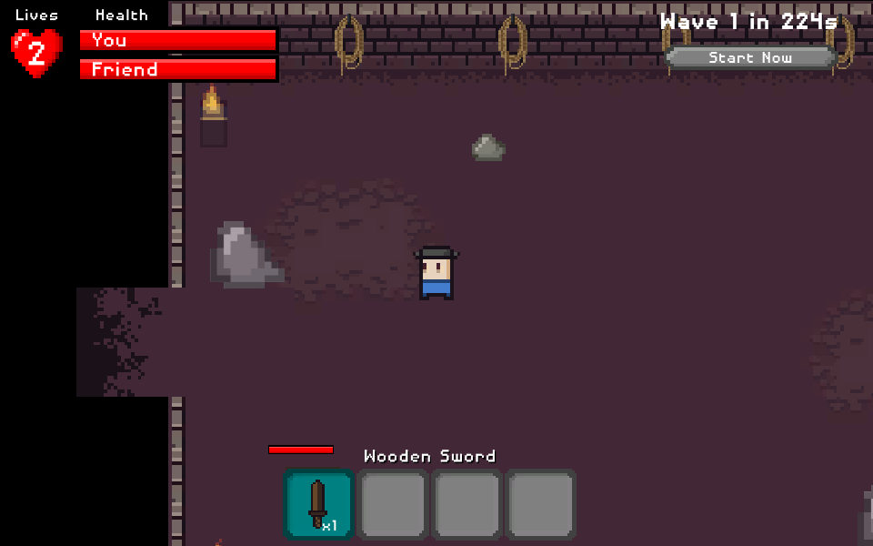
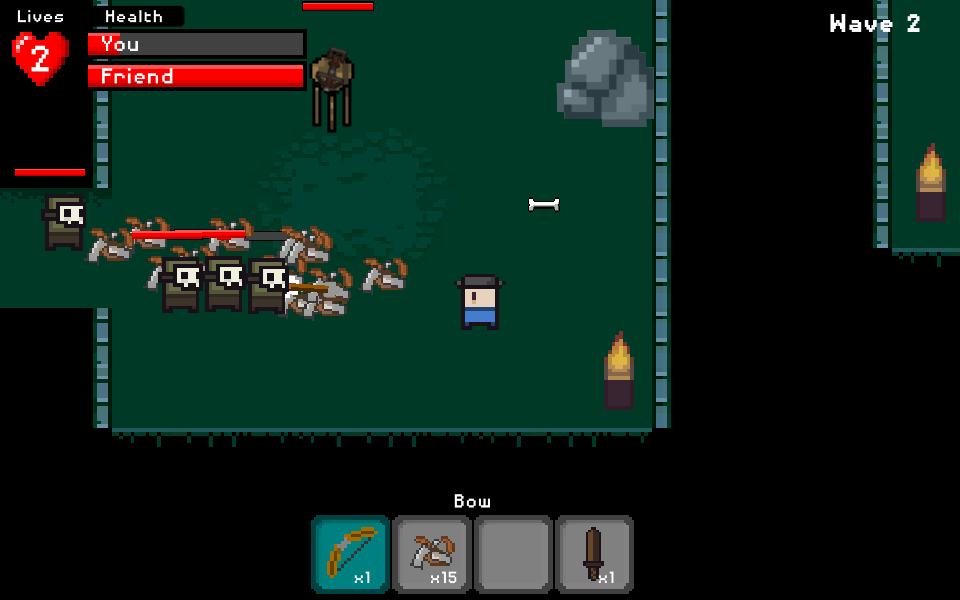
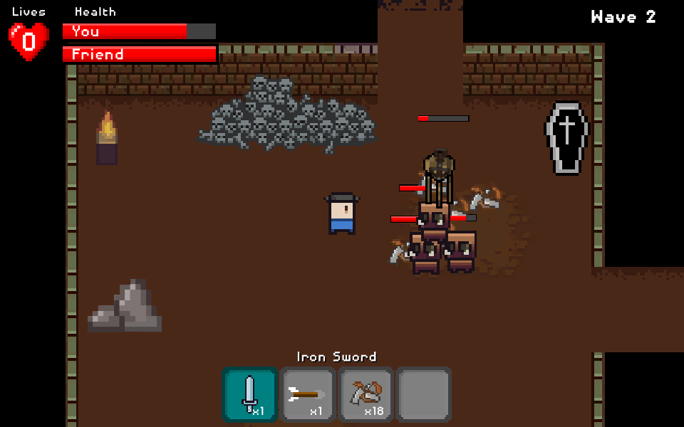

# Dungeon Offence
A public release of Dungeon Offence; a game that's a cross between a tower defence and a dungeon crawler.

___

## Dungeon Offence / CISC226

This is our (Kennan/Josh/Kevin) CISC226 (Winter 2021) WebGL game: Dungeon Offence. A built version of the game from Apr.11.2021 has been included here for preservation purposes.  As of Sep.3.2021, an active copy of this build can be played [from this link](https://hypercubed-music.github.io/Dungeon-Offence/).

This project taught us how to effectively use Git within a team, how to organize a large-scale project, how to receive and iterate on criticism, how to improve our teamwork and communication skills, and was overall a fun experience.

## Reports
Below are some reports completed during CISC226 regarding the project.
- [A1: Project Proposal (PDF)](reports/a1_project_proposal.pdf)
- [A3: Progress Report (PDF)](reports/a3_progress_report.pdf)
- [A4: Final Reflection (PDF)](reports/a4_final_reflection.pdf)

## About the Game
Below is a summary quickly pieced together from existing material:

	Dungeon Offence is a tower-defense game where you, the player, are also a character on the map, where you can interact with the towers and waves in real-time.

	You can run around in a dungeon like in a dungeon crawler, but you are also able to place defense towers within the dungeon. Towers require maintenance and reloading, whereas engaging yourself is more risky. Your goal is to stop enemies from traversing through a series of rooms and reaching the end.

	If you take too much damage, or let too many enemies get to the end, you lose a life. After losing all lives, the game ends and the level restarts.

	Enemies appear in waves, with each level having enemies appearing at displayed intervals. These enemies drop resources which you can then use to make new towers, repair existing towers, or craft better gear for yourself.

	After all waves have been defeated, you may move on to the next level. Stronger gear and towers appear as the player progresses.

## Screenshots

## Acknowledgements
- Many sprites are from https://0x72.itch.io/16x16-dungeon-tileset.
- Audio/Music were created by Josh.

___
## Notice of Archival (Sep.2021)
This is a snapshot of the contents of the original repository from when the term ended (this README is new). Full names have been removed for privacy reasons.